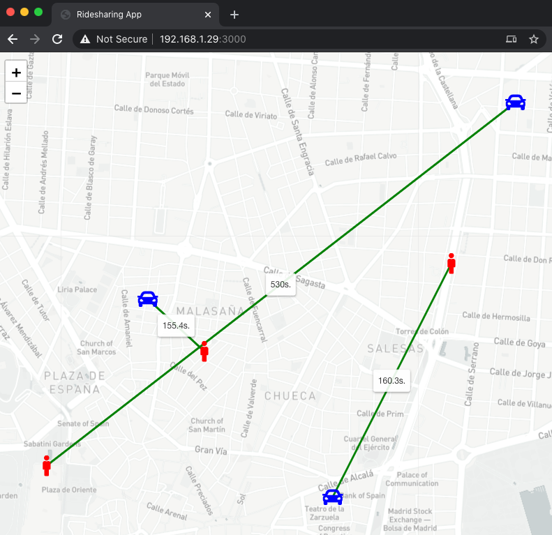
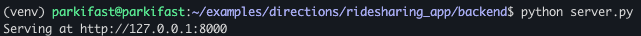
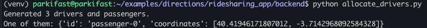

# Ridesharing APP

In this example, we have developed a complete sample platform for a ridesharing
company. It consists in two parts: backend and frontend. This company tries to perform the minimun waiting time for their passengers,
between they request a driver and the driver arrives to a passenger.



In the **backend**, a script (backend/allocate_drivers.py) in every execution allocates
free drivers with passengers requests to find the minimum waiting time. Also, a server API is 
ready to serve this information to the drivers app.

In the **frontend**, a Web Application shows in a map the result for all these allocations in a 
specific time.

## Backend

Written in Python. Firstly, serve the API: `python server.py`.



Now we can allocate drivers and passengers. This script generate randomly drivers and passenger, 
and allocate them. Execute: `python allocate_drivers.py`



We can check the result on matrix and allocations JSON files, or in our browser: **http://127.0.0.1:8000**.

```
{
    "timestamp": 1605864430, 
    "data": [
        {"driver": {"id": "driver-1", "coordinates": [40.42729401487107, -3.7080592345391077]}, 
        "passenger": {"id": "passenger-2", "coordinates": [40.42483048800657, -3.7045916368712093]}, 
        "duration": 155.4}, 
        {"driver": {"id": "driver-2", "coordinates": [40.418017188096414, -3.6966942087269037]}, 
        "passenger": {"id": "passenger-1", "coordinates": [40.42895575709332, -3.6893795211104097]}, 
        "duration": 160.3}, 
        {"driver": {"id": "driver-0", "coordinates": [40.43649746305027, -3.6854208060360167]}, 
        "passenger": {"id": "passenger-0", "coordinates": [40.41946171807012, -3.7142968092584328]}, 
        "duration": 530.0}
    ]
}
``` 

## Frontend

Written in JavaScript and HTML. Start the app: `python main.py`.

Navigate to: **http://127.0.0.1:3000** and see the links between drivers and passengers.
