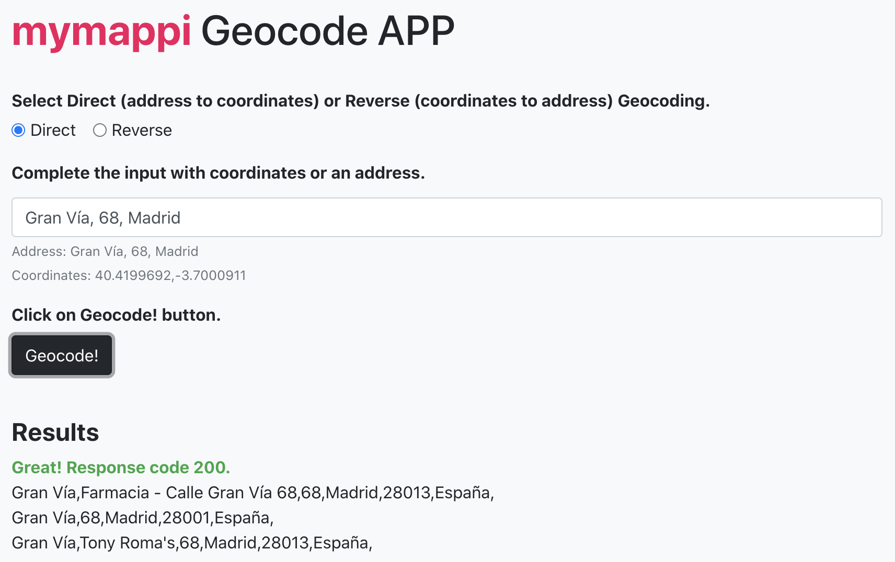

# Geocode APP

In this example, we have created an app where user can geocode anything.

It consists in two files. One HTML (index.html) where users can choose between
Direct or Reverse Geocode and complete the text input with coordinates or an
address. And one JavaScript file (main.js) with all the methods needed to get
user inputs from the form, perform the request and handle, validate and show 
the response.

Geocode!

