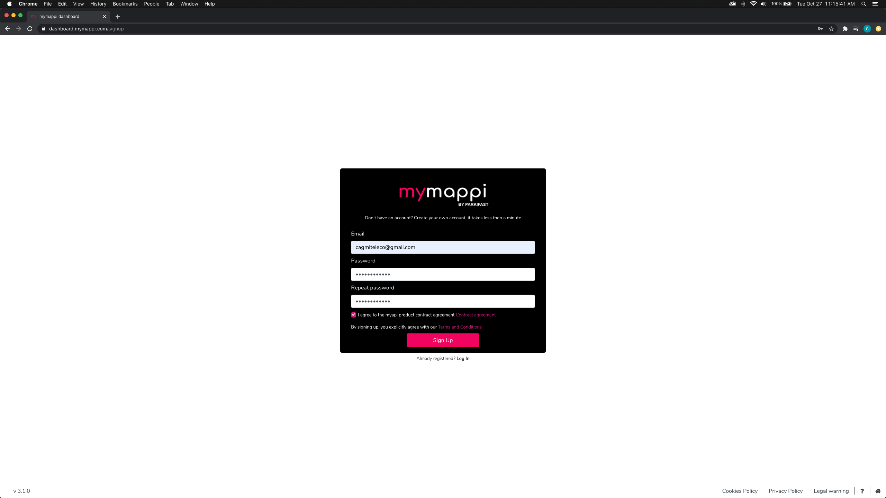

# Getting Starter

Vamos a pintar un punto en el mapa.

Pasos:
1. Conseguir API Key
2. Ver documentación y probar consulta
3. Generar HTML mapa
4. Pintar punto en el mapa

## Obtención de la API Key

Ir a la web de [mymappi](https://mymappi.com/)

Completamos los campos necesarios: correo electrónico y contraseña.

Una vez registrados reciviremos un correo electrónico de confirmación, 
y clicamos en el botón o en el enlace.

Tras ser confirmados, nos vamos al [Dashboard de mymappi]() para obtener nuestra API Key.
Nos logeamos y clicamos en el menú sobre el botón de myapi y API Token.
En esta pantalla obtendremos nuestra API Key, podemos ver el plan que tenemos y 
un enlace a la documentación que utilizaremos en el siguiente apartado.

## Ver documentación y probar consulta